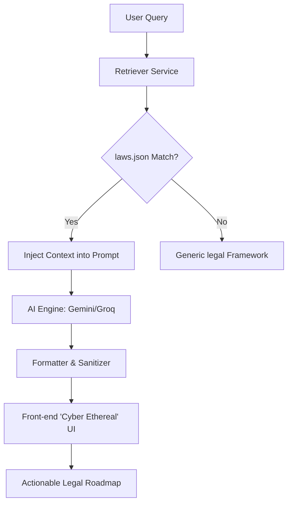

# ⚖️ न्याय Netra — See the Law Clearly.

**न्याय Netra** (Nyaya Netra) is an AI-powered legal consultation system designed to demystify Indian statutes, specifically bridging the gap between legacy laws and the new **BNS/BNSS 2023** framework. Built with a **"Cyber Ethereal"** aesthetic, it combines precision legal retrieval with an immersive user experience.

---

## ✨ Features

- 🧠 **Context-Aware RAG Logic**: Grounded in 500+ Bare Acts and 1M+ Case Records for factual reliability.
- 🎨 **Cyber Ethereal UI**: High-fidelity glassmorphism, physics-based cursor tracing, and refined micro-animations.
- 🚀 **Structured Action Plans**: Converts legal jargon into "Next Steps," "Proof Required," and "Risk Assessment."
- ⚛️ **Dual-Model Support**: Primary inference via **Gemini 1.5 Flash** with high-speed fallback on **Groq (Llama 3.1 70B)**.
- 💬 **Conversational Depth**: Remembers history and maintains a mentor-like, empathetic persona.

---

## 🛠️ Tech Stack

- **Frontend**: React.js, Vite, Vanilla CSS (Custom Design Tokens).
- **Backend**: FastAPI (Python), uvicorn.
- **AI/LLM**: Google Gemini SDK, Groq SDK.
- **Data Engine**: Retrieval-Augmented Generation (RAG) with local legal knowledge base.

---

## 🏗️ Project Architecture

---

## 🚀 Getting Started

### Prerequisites
- Python 3.9+
- Node.js 18+
- API Keys for Gemini (Google AI) and/or Groq.

### Backend Setup
1. `cd backend`
2. `python -m venv venv`
3. `source venv/bin/activate` (or `.\venv\Scripts\activate` on Windows)
4. `pip install -r requirements.txt`
5. Create a `.env` file from `.env.example`.
6. `uvicorn app.main:app --reload`

### Frontend Setup
1. `cd frontend`
2. `npm install`
3. `npm run dev`

---

## ❤️ Vision
Nyaya Netra aims to make legal clarity a fundamental right, enabling every Indian citizen to understand their legal standing in seconds. 

Built by [Sarvesh Ghotekar](https://sarveshghotekar.in).
