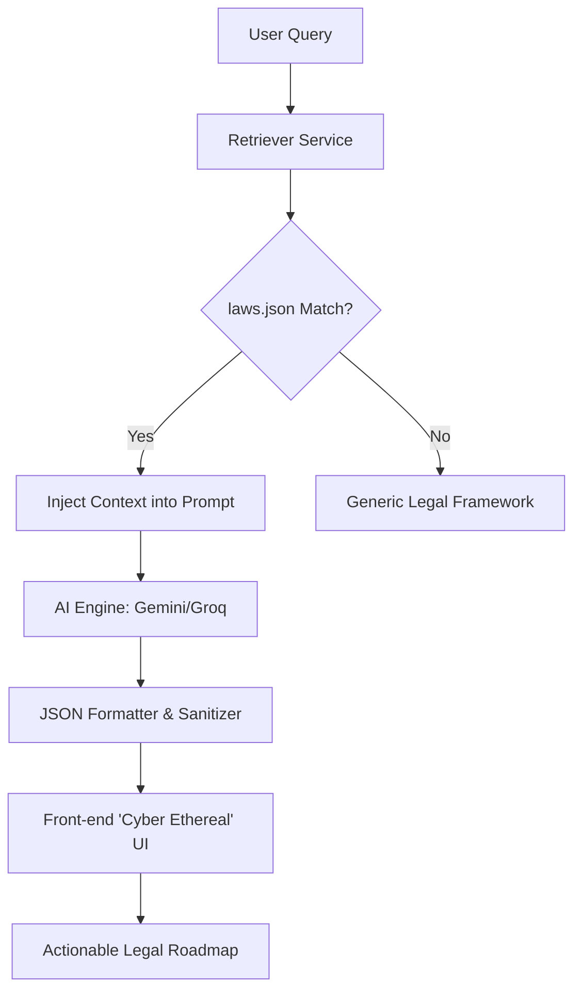

# 🚀 Nyay Netra Launch & Showcase Kit

This document contains the promotional assets and technical architecture for the **Nyay Netra** project. Use these to showcase the project on LinkedIn, Twitter, and in your demo video.

---

## 📱 1. LinkedIn Post Content
**Goal**: Highlight the "System" aspect and the "Cyber Ethereal" design.

**Headline**: I didn’t just build a project. I built a system for justice. ⚖️✨

Legal jargon shouldn't be a barrier to our rights. With the transition to BNS/BNSS in India, the complexity has only increased. Say hello to **न्याय Netra** — Seeing the Law clearly.

**What makes it different?**
- 🧠 **RAG-Powered Intelligence**: It doesn't just "chat"; it scans 500+ Bare Acts and 1M+ Case Records for factual groundedness.
- 🎨 **Cyber Ethereal Design**: A premium, high-fidelity UI built with glassmorphism and physics-based cursor tracing.
- 🚀 **Structured Roadmaps**: Converts statutes into plain language with specific "Next Steps" and "Risk Analysis."

**The Tech Stack:**
- **Frontend**: React.js + Custom Vanilla CSS Design System.
- **Backend**: FastAPI (Python) + RAG Pipeline.
- **AI**: Gemini 1.5 Flash (Primary) with Groq/Llama 3.1 (Fallback).

My vision is to make legal clarity a right, not a luxury. 

Check out the walkthrough video below! 👇

#LegalTech #AI #BuildInPublic #NyayNetra #ReactJS #FastAPI #IndianLaw #UXDesign

---

## 🎥 2. Project Walkthrough Video Script (Enhanced)
**Theme**: The perfect blend of Aesthetics and Engineering.

| Segment | Visual Action | Dialogue/Voiceover |
| :--- | :--- | :--- |
| **01. The Hook** | Cursor moving across the Hero section. The glow trails follow perfectly. | "The law is a maze. न्याय Netra is the light. Welcome to a new era of legal clarity." |
| **02. The Problem** | Scrolling past the 'Legal Understanding' feature cards. | "We've traded heavy law books for an 'Ethereal' interface that works as fast as you think." |
| **03. The Demo** | Type "Landlord refusing deposit" into the interactive chat demo. | "When you ask a question, our system doesn't just guess. It activates a sophisticated RAG pipeline." |
| **04. THE PIPELINE** | **[Show Pipeline Diagram]** (Overlay the Mermaid diagram below). | "First, it retrieves factual statutes from our local laws.json. Then, it cross-references precedents before our AI sanitizes the final output into plain English." |
| **05. Resiliency** | Show the 'Model Used' tag (Gemini/Groq) at the bottom. | "And it's built to last. With dual-model support, Gemini handles the logic, while Groq stands ready as a high-speed fallback." |
| **06. The Close** | Final scroll to the footer with the "Sarah Ghotekar" credit visible. | "This isn't just a chatbot. It's न्याय Netra. See the law clearly." |

---

## 🛠️ 3. The Technical Pipeline (The System Architecture)

### RAG Pipeline Flow

**System Breakdown**:
1.  **Retrieval**: Matches user keywords against a curated SQLite or JSON database of the latest Indian Penal Codes.
2.  **Augmentation**: Injects that specific statute into the AI's system prompt to prevent hallucinations.
3.  **Generation**: The AI generates a structured response including "Legal Right," "Next Steps," and "Risk Level."
4.  **Sanitization**: A dedicated Python utility removes AI artifacts and ensures perfect JSON for the UI.

---

## 🚢 4. Deployment Pipeline (Recommended)

To put this live, follow this **Shipping Pipeline**:

1.  **Backend (Production)**:
    - Deploy to **Render** or **Railway**.
    - Set environment variables: `GEMINI_API_KEY`, `GROQ_API_KEY`.
    - Run: `uvicorn app.main:app --host 0.0.0.0 --port $PORT`

2.  **Frontend (Production)**:
    - Deploy to **Vercel** or **Netlify**.
    - Set `VITE_API_BASE_URL` to point to your backend.
    - Run: `npm run build`

3.  **CI/CD**:
    - Use GitHub Actions to run `pytest` on the backend and `npm run lint` on the frontend before every merge to `main`.
