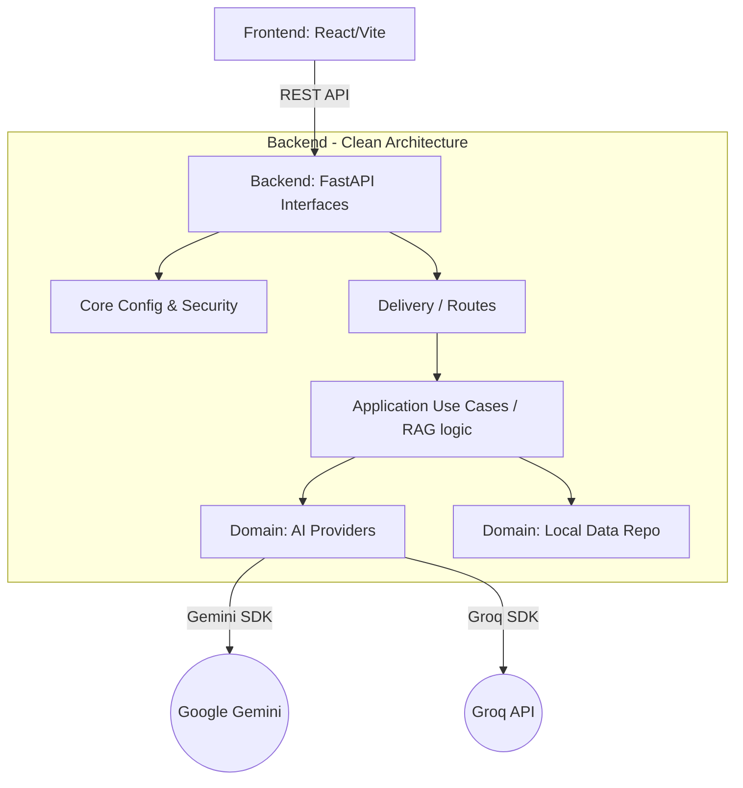

# 🏛️ Nyaya Netra — Clean Architecture & System Design

<div align="center">
  
  
</div>

> Achieving **Clean Architecture** means decoupling business logic from external frameworks, UIs, and databases. Nyaya Netra follows a strict separation of concerns, ensuring high maintainability, testability, and scalability.

---

## 🧩 The Big Picture

Nyaya Netra functions as a decoupled **Client-Server** application interacting with external AI providers. The application logic is divided into rigid domains:



---

## 📁 Directory Architecture

### 1. The Frontend (Presentation Layer)
Designed for specific feature isolation. The UI is built to interact with "facades" rather than raw API logic.

```text
frontend/src/
├── api/             # API Gateways (Encapsulates axios calls)
├── components/      # Reusable, stateless generic components
├── features/        # Business-logic heavy UI modules (e.g., Chat, Analysis)
├── pages/           # High-level entry components assembling features
├── assets/          # Static elements (CSS, images)
```

### 2. The Backend (Business & Data Layers)
Built on Domain-Driven Design principles adapted for FastAPI.

```text
backend/app/
├── core/            # App-wide settings, security, limits (Infrastructure)
├── data/            # Local JSON corpora (Simulated Database)
├── models/          # Schemas and DTOs (Domain Layer)
├── routes/          # REST Controllers (Presentation Layer for backend)
├── services/        # The Core Business Logic (Application Layer)
│   ├── ai.py        # Adapter for external LLMs
│   ├── formatter.py # Output parsing
│   ├── rag.py       # Orchestrator
│   └── retriever.py # Context builder
```

---

## 🛠️ Design Patterns Employed

### 1. Fallback / Chain-of-Responsibility Strategy
Located in `app/services/rag.py`. 
If Google's Gemini API fails, the backend seamlessly degrades to Groq (Llama 3.3). This represents a resilient architectural strategy, ensuring uptime despite reliance on external APIs.

### 2. RAG (Retrieval-Augmented Generation)
Rather than raw inference, Nyaya Netra intercepts the query, pulls relevant statutory context from `data/laws.json`, concatenates this with conversational `history`, and feeds the localized prompt to the AI.

### 3. Rate Limiting Middleware
Global limits protect the boundary using `slowapi`. This sits at the `core` layer, preventing abuse before requests even touch the `services` layer.

---

## 🚀 Why This Architecture Matters
1. **Testability**: Because `ai.py` and `retriever.py` are isolated, we can run unit tests on formatting and logic without mocking entire HTTP layers.
2. **Swapability**: If we migrate from `laws.json` to PostgreSQL/Supabase, we only edit `retriever.py` (and add a repository). `rag.py` and the `routes` remain untouched.
3. **Frontend Resilience**: Centralizing Axios calls into an `api/` directory means if the backend payload changes, only the api gateway in the frontend updates, not the individual components.
