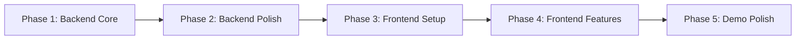

# ⚖️ Nyaya Netra — Phased Task Plan

> **Goal**: A working RAG-based legal assistant with a premium "Cyber Ethereal" UI.

---

## Phase 1: Backend Core (The Engine)
> Get the backend functional end-to-end. A query goes in, a structured JSON answer comes out.

| # | Task | File(s) | Status |
|---|------|---------|--------|
| 1.1 | **Setup [config.py](file:///c:/Users/Lenovo/Documents/VSCode/Nyay%20Netra/backend/app/core/config.py)**: Load [.env](file:///c:/Users/Lenovo/Documents/VSCode/Nyay%20Netra/backend/.env) with `dotenv`, expose `GEMINI_API_KEY`, `GROQ_API_KEY`, and `DATA_PATH` | [app/core/config.py](file:///c:/Users/Lenovo/Documents/VSCode/Nyay%20Netra/backend/app/core/config.py) | ✅ |
| 1.2 | **Populate [laws.json](file:///c:/Users/Lenovo/Documents/VSCode/Nyay%20Netra/backend/app/data/laws.json)**: Add 8–10 diverse legal entries (rent, consumer, labor, cyber, FIR, property, marriage, cheque bounce) with `keywords`, `issue`, `law`, `steps`, `risk` | [app/data/laws.json](file:///c:/Users/Lenovo/Documents/VSCode/Nyay%20Netra/backend/app/data/laws.json) | ✅ |
| 1.3 | **Build Retriever**: Load [laws.json](file:///c:/Users/Lenovo/Documents/VSCode/Nyay%20Netra/backend/app/data/laws.json), match user query words against entry keywords, return top 2 matching context strings | [app/services/retriever.py](file:///c:/Users/Lenovo/Documents/VSCode/Nyay%20Netra/backend/app/services/retriever.py) | ✅ |
| 1.4 | **Build AI Layer**: Implement `call_gemini()` (primary) and `call_groq()` (fallback) with try/except, returning parsed JSON | [app/services/ai.py](file:///c:/Users/Lenovo/Documents/VSCode/Nyay%20Netra/backend/app/services/ai.py) | ✅ |
| 1.5 | **Build RAG Engine**: Wire retriever → prompt builder → AI call → return structured dict | [app/services/rag.py](file:///c:/Users/Lenovo/Documents/VSCode/Nyay%20Netra/backend/app/services/rag.py) | ✅ |
| 1.6 | **Define Schemas**: Create [QueryRequest](file:///c:/Users/Lenovo/Documents/VSCode/Nyay%20Netra/backend/app/models/schemas.py#4-7) and `QueryResponse` Pydantic models with all fields (`issue`, `law`, `steps`, `risk`, `advice`, `disclaimer`, `model_used`) | [app/models/schemas.py](file:///c:/Users/Lenovo/Documents/VSCode/Nyay%20Netra/backend/app/models/schemas.py) | ✅ |
| 1.7 | **Setup Route**: Create `POST /ask` endpoint using the schema and RAG engine | [app/routes/query.py](file:///c:/Users/Lenovo/Documents/VSCode/Nyay%20Netra/backend/app/routes/query.py) | ✅ |
| 1.8 | **Setup `main.py`**: Initialize FastAPI app, add CORS middleware, include router | `app/main.py` | ✅ |

**✅ Phase 1 Done When**: Running `uvicorn app.main:app --reload` and hitting `POST /ask` with `{"query": "my landlord won't return deposit"}` returns a full structured JSON response.

---

## Phase 2: Backend Polish (Reliability & Quality)
> Make the system robust, handle edge cases, and add logging.

| # | Task | File(s) | Status |
|---|------|---------|--------|
| 2.1 | **Add Response Formatter**: Clean/validate AI output, handle cases where AI returns malformed JSON | `app/services/formatter.py` | ✅ |
| 2.2 | **Add Response Time Logging**: Log time taken by retriever and AI call separately using `time.time()` | [app/services/rag.py](file:///c:/Users/Lenovo/Documents/VSCode/Nyay%20Netra/backend/app/services/rag.py) | ✅ |
| 2.3 | **Add Disclaimer**: Automatically append a legal disclaimer to every response | [app/models/schemas.py](file:///c:/Users/Lenovo/Documents/VSCode/Nyay%20Netra/backend/app/models/schemas.py) | ✅ |
| 2.4 | **Error Handling**: Add proper HTTP error responses (422 for bad input, 503 for AI failure) | [app/routes/query.py](file:///c:/Users/Lenovo/Documents/VSCode/Nyay%20Netra/backend/app/routes/query.py) | ✅ |
| 2.5 | **Health Check Endpoint**: Add `GET /health` for quick server status verification | [app/routes/query.py](file:///c:/Users/Lenovo/Documents/VSCode/Nyay%20Netra/backend/app/routes/query.py) | ✅ |

**✅ Phase 2 Done When**: Bad queries return clean errors, AI failures fall back gracefully, and every response includes timing info + disclaimer.

---

## Phase 3: Frontend Setup (The Shell)
> Scaffold the React app and establish the "Cyber Ethereal" design system from [DESIGN.md](file:///c:/Users/Lenovo/Documents/VSCode/Nyay%20Netra/stitch_nyaya_netra_master_plan/nyaya_cyber_ethereal/DESIGN.md).

| # | Task | File(s) | Status |
|---|------|---------|--------|
| 3.1 | **Scaffold React App**: Initialize a Vite + React project inside `frontend/` | `frontend/` | ⬜ |
| 3.2 | **Install Dependencies**: Add `axios` (API calls) and Google Fonts (Manrope, Inter, Plus Jakarta Sans) | `frontend/package.json` | ⬜ |
| 3.3 | **Create Design Tokens CSS**: Translate [DESIGN.md](file:///c:/Users/Lenovo/Documents/VSCode/Nyay%20Netra/stitch_nyaya_netra_master_plan/nyaya_cyber_ethereal/DESIGN.md) color palette, typography, elevation rules into CSS custom properties | `frontend/src/index.css` | ⬜ |
| 3.4 | **Create App Layout**: Build the 3-panel layout (Sidebar + Chat Area + Insight Panel) from [code.html](file:///c:/Users/Lenovo/Documents/VSCode/Nyay%20Netra/stitch_nyaya_netra_master_plan/nyaya_netra_main_app_ui/code.html) reference | `frontend/src/App.jsx` | ⬜ |

**✅ Phase 3 Done When**: `npm run dev` shows the dark-mode 3-panel skeleton with correct colors, fonts, and glassmorphism.

---

## Phase 4: Frontend Features (Making it Alive)
> Connect the UI to the backend and make interactions work.

| # | Task | File(s) | Status |
|---|------|---------|--------|
| 4.1 | **Build Chat Input Component**: Text input with send button, gradient glow border, attach icon | `frontend/src/components/ChatInput.jsx` | ⬜ |
| 4.2 | **Build Message Bubbles**: User bubble (right-aligned, dark) and AI bubble (left-aligned, purple border, with tags) | `frontend/src/components/ChatBubble.jsx` | ⬜ |
| 4.3 | **Build Insight Panel**: Issue Summary, Governing Statutes, Action Steps, Risk Level bar, Expert Insight cards | `frontend/src/components/InsightPanel.jsx` | ⬜ |
| 4.4 | **API Integration**: Connect chat input → `POST /ask` → display AI response in both chat and insight panel | `frontend/src/services/api.js` | ⬜ |
| 4.5 | **Loading State**: Add typing animation (3 bouncing dots) while waiting for AI response | `frontend/src/components/ChatBubble.jsx` | ⬜ |
| 4.6 | **Sidebar Navigation**: Home, New Chat, History, Settings links with active state styling | `frontend/src/components/Sidebar.jsx` | ⬜ |

**✅ Phase 4 Done When**: User types a query → sees typing dots → gets a rich AI response in chat + structured data in the right panel.

---

## Phase 5: Integration & Demo Polish
> Final touches to make it demo-ready.

| # | Task | File(s) | Status |
|---|------|---------|--------|
| 5.1 | **Show Model Indicator**: Display "Powered by Gemini" or "Fallback: Groq" badge on each AI response | Chat + Insight Panel | ⬜ |
| 5.2 | **Chat History (Local)**: Store conversation in React state so user can scroll back through the session | `App.jsx` | ⬜ |
| 5.3 | **Responsive Cleanup**: Ensure sidebar collapses on smaller screens | CSS | ⬜ |
| 5.4 | **Add [.env](file:///c:/Users/Lenovo/Documents/VSCode/Nyay%20Netra/backend/.env) Keys**: Insert real Gemini API key (free from Google AI Studio) | [backend/.env](file:///c:/Users/Lenovo/Documents/VSCode/Nyay%20Netra/backend/.env) | ⬜ |
| 5.5 | **End-to-End Test Run**: Full flow test with 3-4 different legal queries to verify quality | Manual | ⬜ |

**✅ Phase 5 Done When**: The full system runs, looks stunning, and can be demo'd confidently.

---

## Execution Order

> [!TIP]
> **Start with Phase 1, Task 1.1.** Each task is small enough to complete in one prompt.
> Say **"Do Task 1.1"** and I'll write the code, explain it, and move to the next.
